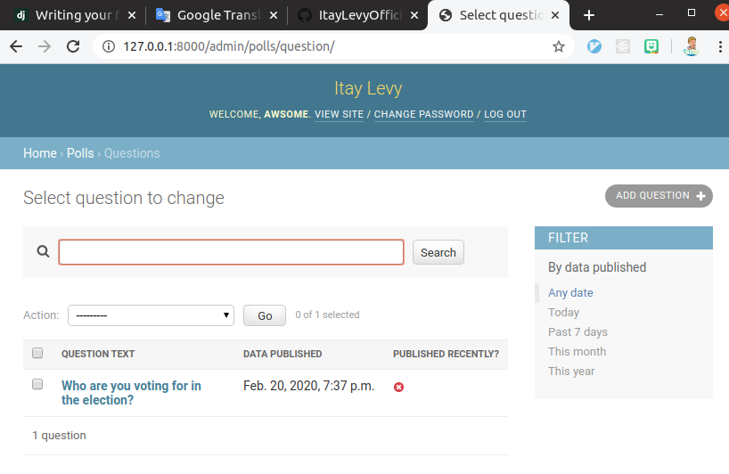
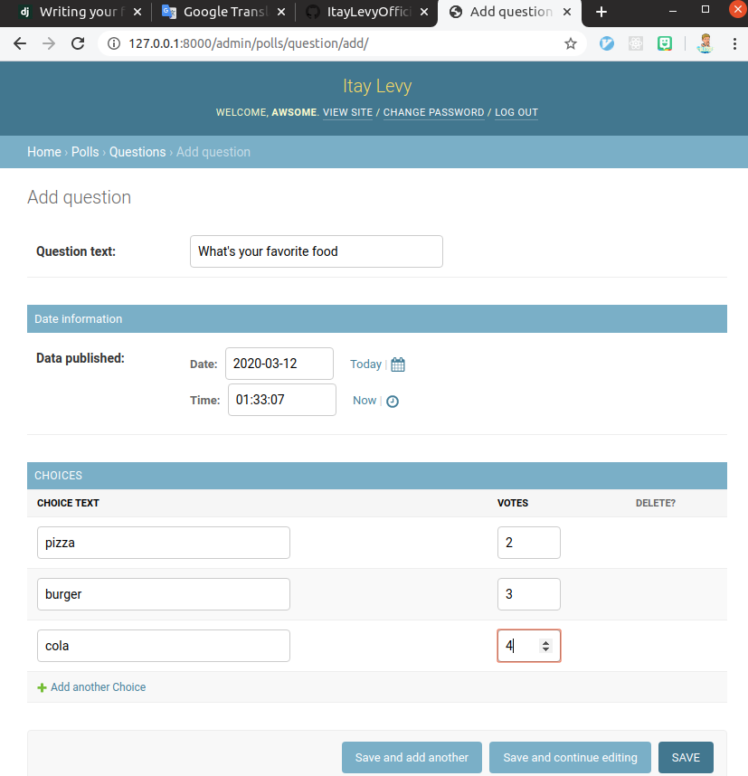

# Polls app
## Polls website, written with django.

## Screenshots:
### Questions admin page

### Add question page


## Supports: 
* ### Adding and deleting questions.
* ### Voting.
* ### Persistent questions and voting count using sqlite.
* ### Searching, sorting and filtering of questions.
## Setup:
### Requirements:
* #### Python 3.7
### Run:
```shell script 
git clone https://github.com/ItayLevyOfficial/polls_app.git
cd polls_app
pip install -r requirements.txt
./manage.py runserver
```

